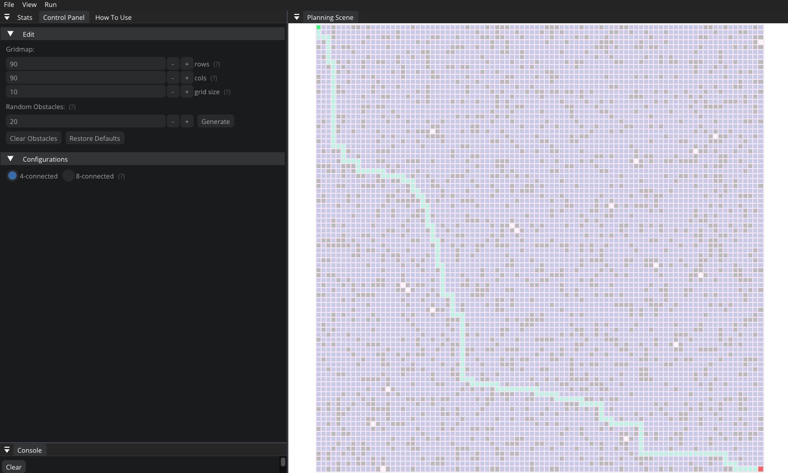

# Visualizer


## **Dependencies**

- **cmake >= 3.14**
  - All OSes: [click here for installation instructions](https://cmake.org/install/)
- **make >= 4.1 (Linux, Mac), 3.81 (Windows)**
  - Linux: make is installed by default on most Linux distros
    > **_LINUX NOT:_** Just install the standard lib deps and then consider just how cooler you are than everyone else.
  - Mac: [install Xcode command line tools to get make](https://developer.apple.com/xcode/features/)
    > **_MAC NOTE:_** Install xcode >= v12.5 and wait 3 years while it sets up.
  - Windows: [Click here for installation instructions](http://gnuwin32.sourceforge.net/packages/make.htm)
    > **_WINDOWS NOTE:_** If you enjoy being happy but are using Windows use gnuwin32, it's less of a headache, and you won't cry for an hour. Not that I did. Shut up; you're the one whos crying.
- **gcc/g++ >= 5.4**
  - Linux: gcc / g++ is installed by default on most Linux distros
  - Mac: same as make - [install Xcode command line tools](https://developer.apple.com/xcode/features/)
  - Windows: recommend using [MinGW](http://www.mingw.org/)

## **Setup**

## Linux

You can either manually run these commands or sudo execute the install script in the root.

`sudo apt-get install libfreetype-dev libudev-dev libglfw3 libglfw3-dev libglfw3-doc`

> **_NOTE:_** A quick sh scripts exists in `/install/linux.sh` that you can use to automatically install the apt deps.

## Mac

**Brew**

You should have brew to make everything easier. You can find it [here](https://brew.sh/). You can install cmake and the other libs manually but Brew will make it easier.

The following shows how to install brew and the required libraries, even if you don't use brew you will need to get these libraries.

```
#Install Homebrew pkg manager
/bin/bash -c "$(curl -fsSL https://raw.githubusercontent.com/Homebrew/install/HEAD/install.sh)"

#Install CMake
brew install cmake

#Install freetype for SMFL
brew install freetype

brew install openssl

brew install libffi

brew install sfml
```

> **_NOTE:_** A quick sh scripts exists in `/install/mac.sh` that you can use to automatically install brew and the deps.

Xcode command line tools are also a requirement. You will need to use Xcode cmd line tools v12.5 and up, ideally v13.X as it is the latest and it's stable. v12.0 and v12.1 cause SFML to fail due to a NSString return issue.

If you run into issues with brew, you can use `brew doctor` to check if symlinks are broken or conflicts emerge. Users who use Macports and switch to Homebrew may encounter some issues.


## Windows

For windows there are pre-compiled binaries located at [cmake.org](https://cmake.org/download/) that you can install. You can also build it manually if you want.

For make just install gnuwin32, or alternatively be adventerous and use [chocolatey](https://chocolatey.org/install).

[Freetype](https://freetype.org/download.html) is also required to build correctly.

## **Build**

The building process is quite simple. Create a new directory in the root called build by running `mkdir build`.

Enter the build directory and run `cmake .. && make`. This will execute CMake, set up the build folder, and build the project.

Once the project is built, run `./main` and the program will pop up!



## **Code**

## Node

BFS and DFS are automatically supported and should act as references for any other modules that you might add.

.CPP and .H are split between src and include to prevent clutter.

When working with the grid, instead of `vector<vector<int>>` you'll be using the node class. The node class contains the following properties:

<details>
  <summary>Click to view properties</summary>

```
// Constructor
Node();

// Destructor
~Node();

// Functions
const bool isObstacle() const;
const bool isVisited() const;
const bool isFrontier() const;
const bool isPath() const;
const bool isStart() const;
const bool isGoal() const;

// Accessors
sf::Vector2i getPos() const;
std::shared_ptr<Node> getParentNode();
const std::vector<std::shared_ptr<Node>>* getNeighbours() const;
const double getGDistance() const;
const double getFDistance() const;

// Mutators
void setObstacle(bool b);
void setVisited(bool b);
void setFrontier(bool b);
void setPath(bool b);
void setStart(bool b);
void setGoal(bool b);
void setPosition(sf::Vector2i pos);
void setNeighbours(std::shared_ptr<Node> node);
void clearNeighbours();
void setParentNode(std::shared_ptr<Node> node);
void setGDistance(double dist);
void setFDistance(double dist);

//protected
// Variables
bool isObstacle_;
bool isVisited_;
bool isFrontier_;
bool isPath_;
bool isStart_;
bool isGoal_;
sf::Vector2i pos_;
std::vector<std::shared_ptr<Node>> vecNeighbours_;
std::shared_ptr<Node> parent_;
double gDist_;
double fDist_;
```

</details>

One of the neat features of node is you can easily access it's neighbours. This is done by using the getNeighbours() function.

```cpp
for (auto node_neighbour : *node_current->getNeighbours()) {
  node_neighbour->setVisited(true);
  node_neighbour->setObstacle(false);
  ...
}
```

## Creating a Graph Based Planner

<details>
  <summary>Click to view BFS / Template example w/ comments!</summary>

```cpp
#include "States/Algorithms/GraphBased/BFS/BFS.h"

namespace visualizer {
namespace graph_based {

// Constructor
BFS::BFS(std::shared_ptr<gui::LoggerPanel> logger_panel)
    : GraphBased(logger_panel) {}

// Destructor
BFS::~BFS() {}

// Override initAlgorithm() function
// Init should handle any extra start logic and clearing the frontier.
void BFS::initAlgorithm() {
  // initialize BFS by clearing frontier and add start node
  while (!frontier_.empty()) {
    frontier_.pop();
  }

  frontier_.push(nodeStart_);
}

// override updateNodes() function
// You can use updateNodes() to add UI logic if you please, here you can // change the start and end positions
void BFS::updateNodes() {
  if (sf::Mouse::isButtonPressed(sf::Mouse::Left) && getKeyTime()) {
    int localY = ((mousePositionWindow_.x - init_grid_xy_.x) / grid_size_);
    int localX = ((mousePositionWindow_.y - init_grid_xy_.y) / grid_size_);

    if (localX >= 0 && localX < map_height_ / grid_size_) {
      if (localY >= 0 && localY < map_width_ / grid_size_) {
        // get the selected node
        std::shared_ptr<Node> selectedNode =
            nodes_[(map_width_ / grid_size_) * localX + localY];

        // check the position is Obstacle free or not
        bool isObstacle = false;
        if (selectedNode->isObstacle()) {
          isObstacle = true;
        }

        if (!is_solved_) {
          if (sf::Keyboard::isKeyPressed(sf::Keyboard::LShift)) {
            if (!isObstacle) {
              if (selectedNode != nodeEnd_) {
                nodeStart_->setStart(false);
                nodeStart_ = selectedNode;
                nodeStart_->setStart(true);
              }
            }
          } else if (sf::Keyboard::isKeyPressed(sf::Keyboard::LControl)) {
            if (!isObstacle) {
              if (selectedNode != nodeStart_) {
                nodeEnd_->setGoal(false);
                nodeEnd_ = selectedNode;
                nodeEnd_->setGoal(true);
              }
            }
          } else {
            selectedNode->setObstacle(!isObstacle);
          }
        } else {
          if (sf::Keyboard::isKeyPressed(sf::Keyboard::LControl)) {
            if (!isObstacle) {
              if (selectedNode != nodeStart_) {
                nodeEnd_->setGoal(false);
                nodeEnd_ = selectedNode;
                nodeEnd_->setGoal(true);
              }
            }
          }
        }
      }
    }
  }
}

// override renderNodes() function
// Render nodes will render the grid, you can do whatever you like here /// in terms of rendering. BFS in this example is an extendable class
// and DFS does not inmplent this as BFS is the parent. If you please
// you can abstract this into it's own class and have all your classes
// extend this.
void BFS::renderNodes(sf::RenderTexture &render_texture) {
  const auto texture_size = render_texture.getSize();

  init_grid_xy_.x = (texture_size.x / 2.) - (map_width_ / 2.);
  init_grid_xy_.y = (texture_size.y / 2.) - (map_height_ / 2.);

  for (int x = 0; x < map_height_ / grid_size_; x++) {
    for (int y = 0; y < map_width_ / grid_size_; y++) {
      float size = static_cast<float>(grid_size_);
      sf::RectangleShape rectangle(sf::Vector2f(size, size));
      rectangle.setOutlineThickness(2.f);
      rectangle.setOutlineColor(BGN_COL);
      rectangle.setPosition(init_grid_xy_.x + y * size,
                            init_grid_xy_.y + x * size);

      int nodeIndex = (map_width_ / grid_size_) * x + y;

      if (nodes_[nodeIndex]->isObstacle()) {
        rectangle.setFillColor(OBST_COL);
      } else if (nodes_[nodeIndex]->isPath()) {
        rectangle.setFillColor(PATH_COL);
        nodes_[nodeIndex]->setPath(false);
      } else if (nodes_[nodeIndex]->isFrontier()) {
        rectangle.setFillColor(FRONTIER_COL);
      } else if (nodes_[nodeIndex]->isVisited()) {
        rectangle.setFillColor(VISITED_COL);
      } else {
        rectangle.setFillColor(IDLE_COL);
      }

      if (nodes_[nodeIndex]->isStart()) {
        rectangle.setFillColor(START_COL);
      } else if (nodes_[nodeIndex]->isGoal()) {
        rectangle.setFillColor(END_COL);
      }
      render_texture.draw(rectangle);
    }
  }

  // visualizing path
  if (nodeEnd_ != nullptr) {
    std::shared_ptr<Node> current = nodeEnd_;
    while (current->getParentNode() != nullptr && !current->isStart()) {
      current->setPath(true);
      current = current->getParentNode();
    }
  }
}

void BFS::renderParametersGui() {}

// Update planner is where all the logic will take place, this and init /// are the most important parts of the code if you have the rendering
// stuff out of the way.

void BFS::updatePlanner(bool &solved, Node &start_node, Node &end_node) {
  if (!frontier_.empty()) {
    std::shared_ptr<Node> node_current = frontier_.front();
    node_current->setFrontier(false);
    frontier_.pop();

    if (node_current->isGoal()) {
      solved = true;
    }

    for (auto node_neighbour : *node_current->getNeighbours()) {
      if (!node_neighbour->isVisited() && node_neighbour->isObstacle() == 0) {
        node_neighbour->setParentNode(node_current);
        node_neighbour->setVisited(true);
        node_neighbour->setFrontier(true);
        frontier_.push(node_neighbour);
      }
    }
  } else {
    solved = true;
  }
}

}  // namespace graph_based
}  // namespace visualizer
```

</details>

Make sure that once the classes are created you update the UI dropdown in the root and you update the ini file. DFS and BFS are implemented in the root, you can follow the sample implementation process.

## **SFML**

This drove me nuts but if you want to, read up on [IMGUI-SFML](https://github.com/eliasdaler/imgui-sfml) and you can technically turn this into pacman by adding some custom assets.

## **Notes**

I forked this from another repo and added some features from a few other random repos I found while exploring. I also added a random obstacles function, better docs, performance fixes, fixed UI glitches between environments, and set up some build tools. Hope this is useful!
